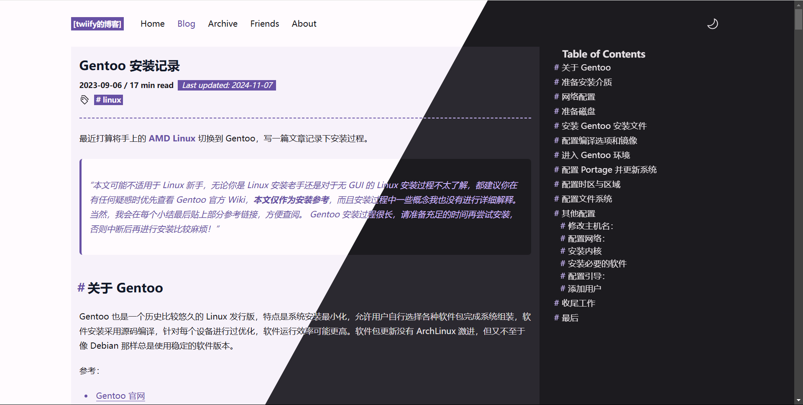
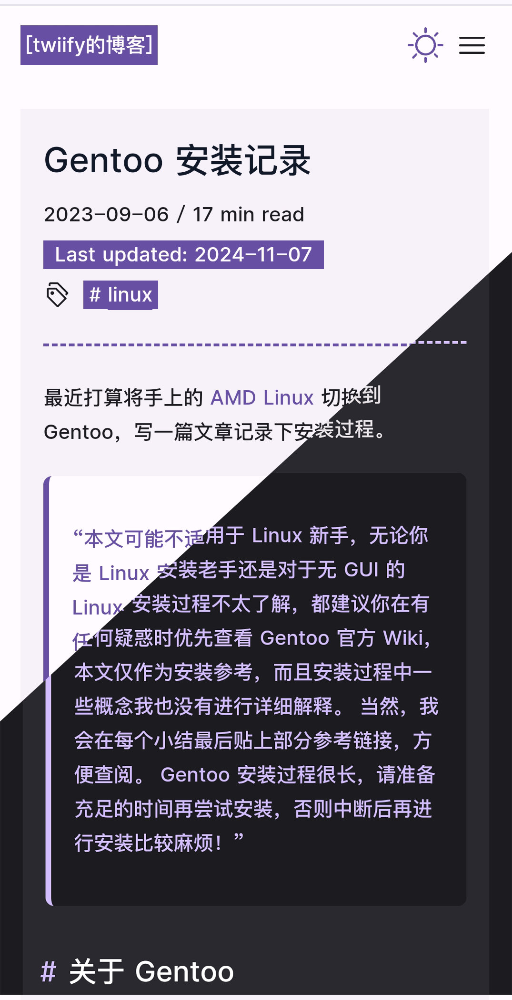

<a name="readme-top"></a>

<div align="center">
  <p align="center">
    <h1>Astro Theme Code</h1>
    <p>
      基于 <a href="https://github.com/kirontoo/astro-theme-cody/tree/v1.3.1">astro-theme-cody v1.3.1</a> 开发的一个简单的 Astro 博客主题，使用 <a href="https://github.com/directus/directus">directus</a> CMS 系统作为博客数据来源。
    </p>
  </p>
</div>

<figure style='display:flex;'>
  
  
</figure>

## 目录

1. [特性](#特征)
2. [命令](#命令)
3. [配置](#配置)
4. [部署](#部署)

## 特征:

-   Astro v5 Fast 🚀
-   TailwindCSS Utility classes
-   Accessible, semantic HTML markup
-   Responsive & SEO-friendly
-   Dark / Light mode, using Tailwind and CSS variables
-   Pinned posts and projects
-   Pagination
-   [Automatic RSS feed](https://docs.astro.build/en/guides/rss)
-   Auto-generated [sitemap](https://docs.astro.build/en/guides/integrations-guide/sitemap/)
-   [Astro Icon](https://github.com/natemoo-re/astro-icon) svg icon component
-   Back To Top button
-   [Katex](https://katex.org/) support
-   Toc highlight support
-   Cloudflare Pages Depoly support

## 命令

所有命令都从项目根目录的终端运行：

| Command                    | Action                                            |
| :------------------------- | :------------------------------------------------ |
| `pnpm install`             | 安装依赖                                          |
| `pnpm run dev`             | 启动本地开发服务器： `localhost:4321`             |
| `pnpm run build`           | 构建生产版本代码到 `./dist/`                      |
| `pnpm run preview`         | 部署前预览本地构建的代码                          |
| `pnpm run astro ...`       | 运行如 `astro add`, `astro check` 等的 astro 命令 |
| `pnpm run astro -- --help` | 获取 astro cli 帮 助                              |

<p align="right">(<a href="#readme-top">back to top</a>)</p>

## 配置

### Site Config, Social Media Links and Navbar Links

网站网址需要在文件 `astro.config.ts` 中 `site` 字段修改。

网站配置、社交媒体链接和导航栏链接配置在文件 `src/consts.ts` 中。
您可以通过该文件配置您的网站默认标题、描述、语言、个人资料、社交媒体链接和可见导航栏链接、代码主题等。

<p align="right">(<a href="#readme-top">back to top</a>)</p>

## 部署

### 博客数据：本地

1. 修改 `src/content/config.ts`

```ts
- import { DirectusLoader, directSchema } from '~/lib/loader/DirectusLoader';
+ import { localBlogSchema } from '~/lib/loader/LocalBlogLoader.ts';

// 博客集合
const blog = defineCollection({
-     type: 'content_layer',
-     loader: DirectusLoader({
-         url: import.meta.env.DIRECTUS_URL,
-         token: import.meta.env.DIRECTUS_TOKEN,
-     }),
-     schema: directSchema,
+     loader: glob({ pattern: '**/[^_]*.md', base: './content/blogs' }),
+     schema: localBlogSchema,
});
```
2. 本地运行：`pnpm run dev`


### 数据：Directus

前提：

1. 拥有 github 和 cloudflare 账号
2. 自部署 directus 或 使用官方服务
3. directus 中新建 `BlogPosts` 数据模型，字段和布局如下：

```ts
export type DirectusBlogPost = {
    id: string;
    title: string;
    description?: string;
    date_created: string;
    date_updated?: string;
    tags?: string;
    katex: boolean;
    pin: boolean;
    draft: boolean;
    content: string;
};
```

如下图：


步骤：

1. [fork](https://github.com/ticks-tan/astro-theme-code/fork) 本仓库
2. 转到 cloudflare pages，链接到 GitHub 账号并授权仓库访问权限
3. 部署仓库，模板选择 `Astro` ，其余选项不变。
4. 新增环境变量如下：

    1. `DIRECTUS_URL`： directus 服务服务器地址（如：`http://<ip>:<port>` 或 `https://<domain>`）
    2. `DIRECTUS_TOKEN`：访问 Token ，以便构建时从 directus 获取数据

5. 执行构建，构建完成！

<p align="right">(<a href="#readme-top">back to top</a>)</p>
